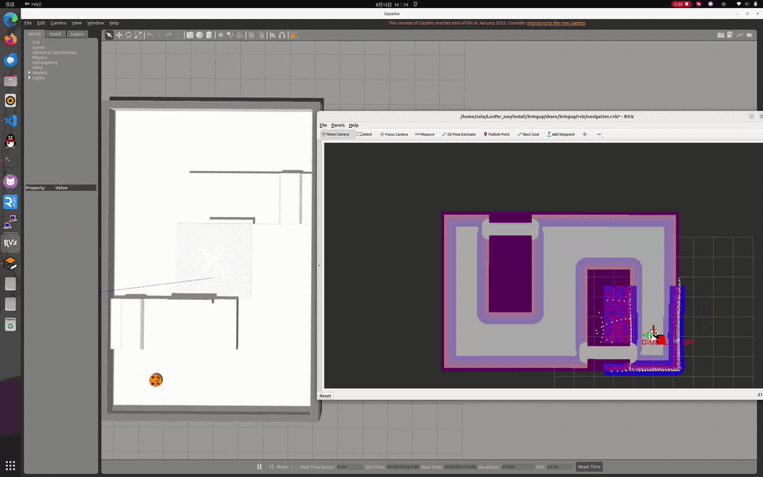

# Lucifer Navigation

RoboMaster 哨兵导航工作空间，ROS 2 Humble + Gazebo Classic 11，支持仿真与实车。

仿真效果演示：



## 一. 项目介绍

传感器是 Livox Mid360（雷达 + 内置 IMU），场地支持 RMUC / RMUL。

`navigation2` 是组件化的单个功能包：10 个导航节点（全局/局部规划、代价地图、路径平滑、
MPC 控制器、隧道云台请求、云台可视化等）编进同一个 shared library，
用 `rclcpp_components` 注册，全部加载进一个 `component_container_mt`，进程内零拷贝。
全局规划用 A*，在 `OccupancyGrid` 上构建 2D 距离场做 clearance cost 让路径远离障碍；
平滑后的 `/plan` 交给 MPC 控制器跟踪，控制器内含弧长进度跟踪、卡住检测、
倒车与安全点脱困恢复链和速度剖面。

数据流：

```text
Mid360 点云 ──┬─► small_glim ──► /Odometry, /lio/robo/odom, /Laser_map, /Laser_map_dense
              │      ▲
              │      └── /livox/imu
              └─► cpp_lidar_filter ──► linefit_ground_segmentation
                                            └─► /segmentation/obstacle
                                                       │
/Laser_map_dense ──► fast_location ──(map→odom)──┐     │
                                                 ▼     ▼
                                        navigation2 (A* + 距离场 + MPC)
                                           │
        /cmd_vel_nav_raw ──► goal_approach_controller
                             ──► /cmd_vel_nav ──► velocity_smoother
                             ──► /cmd_vel ──► fake_vel_transform
                             ──► /cmd_vel_chassis ──► 底盘 / Gazebo
```

主要话题：

| Topic | Type | 说明 |
| :- | :- | :- |
| `/livox/lidar/pointcloud` | `PointCloud2` | 雷达点云（mid360_driver 实车 / 仿真插件统一发这条，不再有 CustomMsg） |
| `/segmentation/obstacle` | `PointCloud2` | 地面分割后的障碍点，代价地图输入 |
| `/Odometry` | `Odometry` | small_glim 里程计（`/lio/robo/odom` 内容相同，供 fast_location） |
| `/Laser_map` | `PointCloud2` | small_glim 世界系点云（odometry 下采样帧，`world` 系，供可视化/调试） |
| `/Laser_map_dense` | `PointCloud2` | small_glim 给 fast_location 的定位稠密点云（更细下采样，`world` 系） |
| `/map` | `OccupancyGrid` | 先验栅格地图 |
| `/goal_pose` | `PoseStamped` | 导航目标 |
| `/plan` `/predict_path` | `Path` | 全局路径 / MPC 预测轨迹 |
| `/cmd_vel_chassis` | `Twist` | 最终底盘速度 |
| `/gimbal_posture` | `GimbalPosture` | 云台收/放请求（rm_tunnel_posture → 电控 / 仿真模拟器） |
| `/gimbal_posture_state` | `GimbalPostureState` | 电控持续回传的云台实态（仿真由 simulated_gimbal 顶替） |
| `/gimbal_status` | `MarkerArray` | 云台状态可视化（RViz 的 GimbalStatus 显示块） |

## 二. 代码结构

```text
src/bringup                                  总启动，仿真/实车两套 launch 与 config
src/driver/mid360_driver                     Mid360 自研驱动（实车，被动收 UDP 推流）
src/driver/livox_ros_driver2                 Livox 官方驱动（实车不再启动，保留给仿真
                                             插件提供 CustomMsg 消息定义）
src/perception/cpp_lidar_filter              去车身点云 + 降采样
src/perception/linefit_ground_segmentation_ros2
                                             地面分割（linefit_ground_segmentation
                                             + _ros 两个包）
src/perception/pointcloud_to_laserscan       建图链：去地面障碍点云 → 2D 扫描
                                             （喂给 slam_toolbox）
src/localization/small_glim                  LIO 里程计与建图（GLIM 精简版，
                                             GTSAM ISAM2 + GICP/iVox）
src/localization/fast_location               点云对先验 PCD 的主定位
src/navigation/navigation2                   导航栈（组件化，A* + 距离场 + MPC）
src/control/goal_approach_controller         目标接近减速
src/control/fake_vel_transform               底盘速度坐标转换
src/control/waypoint_editor                  航点编辑与 follow / patrol 执行器
src/decision/decision_node                   决策节点（包名 decision）
src/interfaces/custom_msgs                   自定义消息（包名 decision_interfaces）
src/serial                                   实车串口（包名 serial_driver）
src/simulation/pb_rm_simulation               Gazebo 场景
src/simulation/ros2_livox_simulation          Livox 仿真插件
src/simulation/simulated_gimbal               仿真专用云台模拟器（顶替电控持续回传）
```

`bringup` 下的关键文件：

```text
launch/sim.launch.py                         仿真入口
launch/real.launch.py                        实车入口
config/fast_location_main.yaml               定位参数
config/mapper_params_online_async.yaml       slam_toolbox 建图参数（mapping 模式）
config/{simulation,reality}/                 分环境的外参、分割、LIO 参数
urdf/sentry_robot_{sim,real}.xacro           机器人模型
map/<world>.msgpack                          语义地图（唯一真源，/map 由它生成）
map/<world>.pgm + .yaml                      slam_toolbox 建图、map_saver_cli 存出的栅格
PCD/<world>.pcd                              fast_location 的先验点云图（small_glim 建）
tools/pgm_to_navmap.py                       pgm+yaml → msgpack 转换
tools/semantic_map_editor.py                 语义地图人工标注：刷隧道、画轴线、填 spec
tools/lidar_extrinsic_calibration.py         雷达外参标定（base_link2livox_frame）
rviz/navigation.rviz                         nav 模式（Fixed Frame = map，含云台状态显示）
rviz/mapping.rviz                            mapping 模式（Fixed Frame = world）
```

`navigation2` 的 10 个组件：`rm_map_server`、`rm_global_costmap`、`rm_global_planner`、
`rm_minco_path_smoother`、`rm_local_costmap`、`rm_mpc_controller`、`rm_velocity_smoother`、
`rm_nav2_compat`、`rm_tunnel_posture`、`rm_gimbal_visualizer`；
`goal_approach_controller` 从独立包组合进同一容器。

## 三. 编译

```sh
source /opt/ros/humble/setup.bash
rosdep install -r --from-paths src --ignore-src --rosdistro humble -y
./build.sh
source install/setup.bash
```

`build.sh` 按依赖顺序、单线程、低优先级编译，避免全量并发把机器压死。
它会检查 `src/` 下是否有没写进列表的包并给出警告。

```sh
./build.sh --list                  # 看编译顺序
./build.sh navigation2 bringup     # 只编指定包，顺序仍按依赖表
```

### 3.1 依赖（换机 / 重装按此顺序）

`small_glim` 硬编码 gcc-13 / C++23，`mid360_driver` 用 asio 收 UDP，两者都需要额外依赖。
重装或换机时按下面顺序装完，再跑 `./build.sh`：

```sh
# 1. gcc-13（small_glim 硬编码 C++23，不可降级）
sudo add-apt-repository ppa:ubuntu-toolchain-r-ubuntu-test/test
sudo apt update
sudo apt install -y gcc-13 g++-13 libstdc++-13-dev

# 2. asio（mid360_driver 收 UDP；两个包都要装，asio_cmake_module 不带出头文件）
sudo apt install -y ros-humble-asio-cmake-module libasio-dev
```

```sh
# 3. gtsam_points v1.2.0（small_glim 的 GICP/iVox 配准库；GTSAM 4.3a0 需先装 /usr/local）
git clone https://github.com/koide3/gtsam_points.git
cd gtsam_points && git checkout v1.2.0
mkdir build && cd build
cmake .. -DCMAKE_BUILD_TYPE=Release -DBUILD_WITH_MARCH_NATIVE=OFF
make -j$(nproc)
sudo make install
sudo ldconfig
```

> **gtsam_points 的 ABI 陷阱**：`-DBUILD_WITH_MARCH_NATIVE=OFF` 必须与 small_glim
> 的编译旗标一致（`-march=native` 两边不一致会在运行期出 ABI 问题），也不要额外加
> ASAN 旗标。装到 `/usr/local` 后必须 `sudo ldconfig` —— 放本地前缀 colcon 找不到，
> 运行期也解析不到 `.so`。GTSAM 4.3a0 同样装 `/usr/local`，缺的话按同旗标先编 GTSAM。

建图链（slam_toolbox 栅格）的依赖都是标准 rosdep 包，`rosdep install` 自动装齐，
无需手工编译：

- **`slam_toolbox`**（`ros-humble-slam-toolbox`）—— 建图，mapping 模式起
  `async_slam_toolbox_node`。
- **`nav2_map_server`** —— 存图用 `map_saver_cli`，随 Navigation2 一起装。
- **`pointcloud_to_laserscan`** —— 本仓库源码包（`src/perception/`），把去地面障碍
  点云转 `/scan` 喂 slam_toolbox，由 `./build.sh` 编译。

> 实车**不再需要** Livox SDK2：`mid360_driver` 是纯 asio UDP 收包，不链接
> `/usr/local/lib/liblivox_lidar_sdk_shared.so`。`livox_ros_driver2` 仅保留在编译列表里，
> 给仿真插件 `ros2_livox_simulation` 提供 CustomMsg 消息定义。

## 四. 运行与调试

### 4.1 常用参数

| 参数 | 默认 | 说明 |
| :- | :- | :- |
| `world` | `RMUL` | 需与 `map/<world>.*`、`PCD/<world>.pcd` 同名 |
| `mode` | `nav` | `mapping` 建图 / `nav` 导航 |
| `nav_rviz` | 仿真 `True`，实车 `False` | 启动 RViz，配置按 `mode` 自动选 |
| `gazebo_gui` | `True` | 仿真专有 |
| `software_rendering` | `False` | 无 GPU 时置 `True`，避免 RViz/Gazebo 段错误 |
| `map_save_dir` | `<bringup>/PCD` | 建图输出目录 |
| `node_output` / `log_level` | `log` / `warn` | 排查时改 `screen` / `info` |
| `use_serial_driver` / `use_decision` | `True` | 实车专有 |


### 4.2 建图

mapping 模式同时跑两条链、产出两张图，nav 模式各用一张：

| 图 | 谁建 | nav 里谁用 | 落盘 |
| :- | :- | :- | :- |
| 点云 PCD | small_glim | `fast_location` 点云定位 | `PCD/<world>.pcd` |
| 栅格 pgm | slam_toolbox | `rm_map_server` 占据栅格 + 语义地图 | `map/<world>.pgm` + `.yaml` |

仿真：

```sh
ros2 launch bringup sim.launch.py world:=RMUL mode:=mapping nav_rviz:=True
```

```sh
ros2 run teleop_twist_keyboard teleop_twist_keyboard --ros-args -r /cmd_vel:=/cmd_vel_chassis
```

实车：

```sh
ros2 launch bringup real.launch.py world:=RMUL mode:=mapping nav_rviz:=True
```

跑完一圈后：

1. 先存栅格 —— slam_toolbox 还活着时另开终端执行（它订阅 `/map` 存当前图）：

   ```sh
   ros2 run nav2_map_server map_saver_cli -f src/bringup/map/RMUL
   ```

   产出 `map/RMUL.pgm` + `map/RMUL.yaml`。

2. 再 **Ctrl-C 退出建图** —— small_glim 的 PCD 合并发生在节点析构时，不干净退出
   `PCD/<world>.pcd` 不会合并落盘，fast_location 就没图可用。

### 4.2.1 生成语义地图

`rm_map_server` 只读 `map/<world>.msgpack`：`/map` 占据栅格由其中 `terrain` 通道的
OBSTACLE 格推导，隧道等「能站但要摆姿态才能进」的先验也存在同一张图里。

```sh
# 1) pgm转 msgpack（三态 terrain：障碍 / 空地 / 未知，隧道格留空）
python3 src/bringup/tools/pgm_to_navmap.py src/bringup/map/RMUL.yaml

# 2) 人工标注：补激光扫不到的围栏、删观众席噪点，把通道标成隧道并画轴线
ros2 run bringup semantic_map_editor.py src/bringup/map/RMUL.msgpack
```

隧道靠人工标：点云里顶板/横梁和墙没有区别，几何上分不出「能钻过去」。编辑器里把
通道格刷成 TUNNEL、用「隧道轴线」工具画出轴向（无向，正反等价），并给每条隧道填
净高/净宽/限速。保存前会按 C++ 加载器的同一套不变量自检，坏图直接拒绝写出。

### 4.2.2 隧道与云台收放

标注进 msgpack 的隧道在导航时由 `rm_tunnel_posture` 驱动云台：车距最近隧道本体格
≤ `run_up`（spec 里配，默认 1.2 m）发「收」，洞里全程保持，距隧道退开
`run_up + hysteresis`（0.3 m）才发「抬」。判据只看距离，跟轴线端点/车头朝向无关。

云台链路（实车）：

```text
rm_tunnel_posture ──/gimbal_posture──► serial_driver ──► 电控（执行收/放）
                                         电控持续回传 /gimbal_posture_state ◄──┘
                                                         │
                                        rm_mpc_controller（请求收而实态还高 → 停车等）
```

MPC 只在「请求收、实测还高」时停车等云台到位；出洞请求抬起后**不等实态**、边走边抬
（确认过的设计，见 `mpc_controller_node.cpp` 门控注释）。电控回传是持续的当前姿态，
仿真里由 `simulated_gimbal` 顶替（动作延迟 0.5 s、20 Hz 持续回传）。RViz 的
`GimbalStatus` 显示块实时画云台实态（绿=收下/低、红=立着/高，方块 z 随实态升降）
和请求命令，实车仿真通用。

### 4.3 导航

```sh
ros2 launch bringup sim.launch.py  world:=RMUL mode:=nav nav_rviz:=True
ros2 launch bringup real.launch.py world:=RMUL mode:=nav
```

### 4.4 实车雷达配置（mid360_driver）

`mid360_driver` 是**纯被动 UDP 收包**：它不给雷达发配置命令，只解析雷达推过来的
0x01 / 0x03 数据包。所以"雷达往哪推"和"驱动读什么"是两套配置，**三处必须一致**：

| 配置项 | 填在哪 | 值 |
| :- | :- | :- |
| 驱动参数 | `config/reality/mid360_driver_real.yaml` | `host_ip: 192.168.10.50`（主机绑包 IP） |
| 雷达推流目标 | Livox Viewer 2 写进雷达 flash（一次性） | 推流到 `192.168.10.50:56300` |
| 主机网卡 | 系统网络配置 | 网卡配 `192.168.10.x`，防火墙放行 56300 / 56301 |

注意 `host_ip` 填的是**工控机自己的 IP，不是雷达 IP**（雷达是另一个网段的设备，
驱动按目标端口收包即可）。三处任何一处不一致，表现都是
`ros2 topic hz /livox/lidar/pointcloud` 无数据。

### 4.5 标定雷达外参（base_link2livox_frame）

`base_link2livox_frame`（`config/{simulation,reality}/measurement_params_*.yaml`）是
雷达相对 base_link 的固定外参。雷达装在云台 yaw 轴上、车是全向轮，整个结构等价于
「一个云台在地上走」，base_link 原点就是旋转中心。于是让车**原地打转**，雷达轨迹
就是绕 base_link 原点的一个圆：圆拟合出圆心 = 旋转中心、半径 = 水平偏移，x/y 就能
恢复出来；z 和安装 yaw 原地打转观测不到，只能手填。

```sh
# 1) 原地打转 1~3 圈（全向轮，让雷达绕 base_link 原点画圆），同时录 /lio/robo/odom
ros2 bag record -o lidar_calib /lio/robo/odom

# 2) 离线标定。z 是雷达离地高度的唯一来源：仿真 0.175（默认），实车 0.49
python3 src/bringup/tools/lidar_extrinsic_calibration.py lidar_calib --mount-z 0.49 --mount-yaw-deg 0
```

脚本打印圆拟合圆心/半径、平移 `[x, y, z]`，并生成 `lidar_extrinsic_result.yaml`；
把其中 `base_link2livox_frame.xyz/rpy` 粘回 `config/reality/measurement_params_real.yaml`
（仿真粘 `config/simulation/measurement_params_sim.yaml`）即可。**只改 yaml**：launch
启动时从 yaml 读值、以 `xyz:=`/`rpy:=` 传给 xacro 覆盖默认值，xacro 里的 `default=`
只在手工单独渲染 URDF 时生效。

要点：

- x/y 是脚本从圆拟合里**估出来的**，不用手填；z（离地高度）和 yaw 手填。
- 订阅 `/lio/robo/odom`：small_glim 把雷达位姿当 `base_link` 发出来（child=base_link
  实为雷达位姿），脚本据此恢复雷达相对 base_link 的偏移。
- roll/pitch 是「绕垂直轴旋转 + 固定倾角」下的 circular mean。倾角绕 y 轴（pitch）
  时结果精确；实车 URDF 现在写的是 `rpy="0.7854 0 0"`（绕 x 轴 roll=45°），绕 x 轴
  的倾角在原地打转时 roll/pitch 会随 yaw 一起变，标出来的 roll/pitch 要结合雷达实际
  安装朝向人工核对，别直接照抄。
- 输出是 `base_link2livox_frame`，不是 small_glim 的 `sensors.T_lidar_imu`，别覆盖
  内部 IMU 外参。
