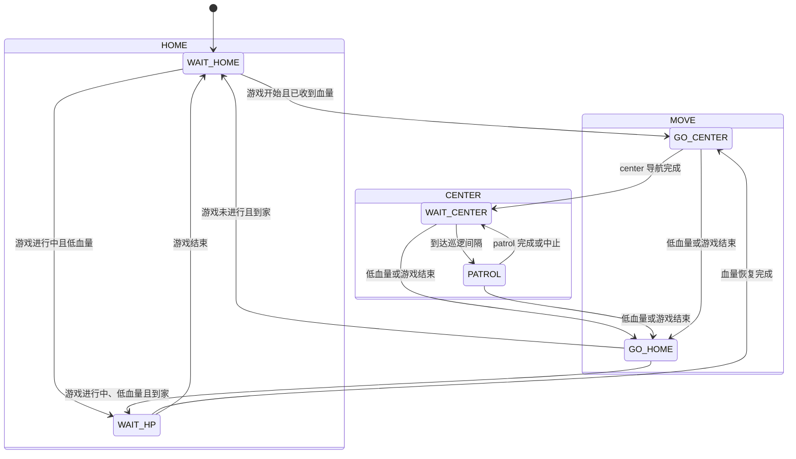

# HL Decision 状态机说明

`HL_decision` 是导航系统中的决策层。它根据比赛状态、机器人血量和导航执行结果，在 `HOME`、`MOVE`、`CENTER` 三个大状态之间切换，并把当前状态对应的航点任务发送给 `waypoint_follow_executor`。

决策节点不会直接规划路径，也不会在循环中创建新的进程。它只负责：

1. 接收比赛和机器人状态。
2. 执行分层状态机。
3. 将状态转换为目标航点文件。
4. 管理 waypoint executor 的启动、切换和执行结果。
5. 向网页发布当前决策状态。

## 1. 状态结构

状态机包含三个大状态和六个叶子状态：

| 大状态 | 子状态 | 状态字符串 | 对应目标 | 作用 |
|---|---|---|---|---|
| `HOME` | `WAIT_HOME` | `HOME.WAIT_HOME` | `wait_home.csv` | 游戏未开始时在出生点等待 |
| `HOME` | `WAIT_HP` | `HOME.WAIT_HP` | `wait_hp.csv` | 低血量回家后等待恢复 |
| `MOVE` | `GO_HOME` | `MOVE.GO_HOME` | `home.csv` | 从其他区域返回家中 |
| `MOVE` | `GO_CENTER` | `MOVE.GO_CENTER` | `center.csv` | 从家中前往中心区域 |
| `CENTER` | `WAIT_CENTER` | `CENTER.WAIT_CENTER` | `wait_center.csv` | 在中心等待下一次巡逻 |
| `CENTER` | `PATROL` | `CENTER.PATROL` | `patrol.csv` | 执行中心区域巡逻路线 |

初始状态固定为：

```text
HOME.WAIT_HOME
```

## 2. 状态切换总览



状态图用于展示主要路径。实际判断还遵循下面的优先级。

## 3. 决策优先级

每次执行 `tick()` 时，状态机按照固定优先级判断。高优先级条件会抢占低优先级行为。

### 3.1 第一优先级：游戏未进行

当比赛状态不满足以下条件时，认为游戏未进行：

```text
game_progress == 4
lower_remain_time <= stage_remain_time <= higher_remain_time
```

处理规则：

- 已经在 `WAIT_HOME`：继续等待。
- 在 `WAIT_HP`：切换到 `WAIT_HOME`。
- 正在 `GO_HOME`：继续回家，到达后进入 `WAIT_HOME`。
- 在中心、巡逻或前往中心：立即切换到 `GO_HOME`。

### 3.2 第二优先级：低血量恢复

血量恢复使用迟滞阈值，避免血量在单个阈值附近波动时频繁切换状态：

```text
current_hp < low_threshold   -> 进入低血量恢复
current_hp >= high_threshold -> 退出低血量恢复
```

默认配置：

```yaml
hp_recovery:
  low_threshold: 120
  high_threshold: 400
```

处理规则：

- 在 `WAIT_HOME` 检测到低血量：直接进入 `WAIT_HP`，因为机器人已经在家。
- 在中心、巡逻或前往中心时检测到低血量：进入 `GO_HOME`。
- `GO_HOME` 到达后：进入 `WAIT_HP`。
- 血量达到高阈值后：进入 `GO_CENTER`。

### 3.3 第三优先级：正常比赛流程

没有游戏结束和低血量抢占时，执行正常流程：

```text
WAIT_HOME -> GO_CENTER -> WAIT_CENTER -> PATROL -> WAIT_CENTER
```

- `WAIT_HOME` 必须已经收到有效血量信息，才会进入 `GO_CENTER`。
- `GO_CENTER` 只有收到 `Center + Succeeded` 事件才进入 `WAIT_CENTER`。
- `WAIT_CENTER` 达到 `patrol_interval_sec` 后进入 `PATROL`。
- `PATROL` 完成或中止后回到 `WAIT_CENTER`，重新开始等待计时。

如果 `targets.enable_patrol` 为 `false`，或者巡逻 CSV 未配置，状态机会一直保持在 `WAIT_CENTER`。

## 4. 导航完成事件

状态机不会仅根据“已经发送目标”切换状态，而是等待 waypoint executor 的结果：

| executor 状态 | 决策事件 |
|---|---|
| `COMPLETED` | `Succeeded` |
| `ABORTED` | `Aborted` |
| `RUNNING` | 更新当前执行目标，不触发状态切换 |

事件包含目标名称，因此只有目标和事件同时匹配时才允许切换。例如：

```text
当前状态：MOVE.GO_CENTER
有效事件：Center + Succeeded
无效事件：Home + Succeeded
```

executor 事件在决策循环中只消费一次，避免同一条完成消息重复触发状态切换。

## 5. 等待状态的持续守点

下面三个状态不是“只发送一次目标”，而是持续守住对应位置：

- `HOME.WAIT_HOME`
- `HOME.WAIT_HP`
- `CENTER.WAIT_CENTER`

守点过程：

1. 第一次进入等待状态时，执行对应 CSV 航点。
2. 到达后通过 TF 获取机器人在 `map` 下的位置。
3. 如果机器人偏离等待点超过 `maintain_goal.xy_tolerance`，开始偏离计时。
4. 持续偏离时间达到 `maintain_goal.drift_hold_sec` 后，重新执行等待目标。
5. 回到容差范围后清除偏离计时。

默认参数：

```yaml
maintain_goal:
  enable: true
  robot_base_frame: base_link_fake
  xy_tolerance: 0.35
  drift_hold_sec: 0.8
```

如果 TF 不可用，决策不会猜测机器人已经偏离，也不会定时重启 executor。失败的 TF 查询最多每秒尝试一次，警告日志会进行节流。这可以避免异常情况下反复重启导航线程造成性能占用。

`GO_HOME`、`GO_CENTER` 和 `PATROL` 是一次性导航任务，不使用持续守点机制。

## 6. 进程和任务管理

独立决策 launch 固定启动两个进程：

```text
bt_action_replacement_node
waypoint_follow_executor
```

决策循环中不会调用 `system()`、`popen()`、`fork()`，也不会启动新的 launch。

目标请求具有以下保护：

- 相同目标正在运行时不重复请求。
- ROS 服务请求尚未返回时，不重复创建普通请求。
- 连续的相同请求会合并。
- 切换执行任务时复用同一个 waypoint executor。
- TF 缺失时不通过定时重发来重启执行线程。

这些限制用于防止“状态异常 → 重发目标 → 重启线程 → 再次异常”的高频循环。

## 7. 数据流

```text
robot_status ─┐
              ├─> DecisionContext
game_status ──┘          │
                         v
                DecisionStateMachine::tick()
                         │
                         ├─> 当前决策状态 -> /decision/state -> Web
                         │
                         v
                  状态对应 TargetName
                         │
                         v
                    WaypointStore
                         │
                         v
               WaypointExecutorClient
                         │
                         v
             waypoint_follow_executor
                         │
                         ├─> /goal_pose -> 导航系统
                         └─> follow_status -> 决策完成事件
```

## 8. Web 决策状态

当前状态发布到：

```text
/decision/state
```

消息类型为：

```text
std_msgs/msg/String
```

示例：

```text
HOME.WAIT_HOME
MOVE.GO_CENTER
CENTER.WAIT_CENTER
CENTER.PATROL
```

该话题使用 `reliable + transient_local` QoS。网页晚于决策节点启动时，也能立即收到最近一次状态，而不必等待下一次状态切换。

## 9. 主要文件

| 文件 | 作用 |
|---|---|
| `src/decision_node.cpp` | ROS 节点、订阅发布、定时循环、TF 和 executor 接入 |
| `src/decision_state_machine.cpp` | 状态切换规则和优先级 |
| `src/decision_state.cpp` | 状态字符串和状态到目标的映射 |
| `src/decision_context.cpp` | 保存机器人状态和比赛状态 |
| `src/waypoint_executor_client.cpp` | waypoint executor 请求和执行状态管理 |
| `src/waypoint_store.cpp` | 加载 CSV 并准备航点 |
| `src/decision_config.cpp` | 声明、读取和校验 ROS 参数 |
| `include/decision/types.hpp` | 目标、执行模式和基础数据类型 |
| `config/bt_action_replacement.yaml` | 决策参数 |
| `launch/decision.launch.py` | 独立启动决策和 waypoint executor |

## 10. 启动方式

```bash
cd ~/HL_navigation_27
source /opt/ros/humble/setup.bash
source install/setup.bash
ros2 launch decision decision.launch.py
```

查看当前决策状态：

```bash
ros2 topic echo /decision/state
```

修改代码后重新编译：

```bash
cd ~/HL_navigation_27
source /opt/ros/humble/setup.bash
colcon build --packages-select decision --symlink-install
source install/setup.bash
```

## 11. 修改状态机时的注意事项

1. 新增状态时，同时更新状态类型、字符串转换和目标映射。
2. 将游戏结束和低血量等抢占条件放在正常流程之前。
3. 导航状态切换必须校验事件对应的目标，不能只判断 `COMPLETED`。
4. 等待状态和移动状态要区分：等待状态可以守点，移动状态只执行一次。
5. 不要在 `tick()` 或定时器回调中创建进程、节点或长期线程。
6. 对重复服务请求、异常状态消息和 TF 缺失增加节流或去重。
7. 修改后至少运行：

```bash
colcon build --packages-select decision --symlink-install
colcon test --packages-select decision
colcon test-result --test-result-base build/decision --verbose
```
