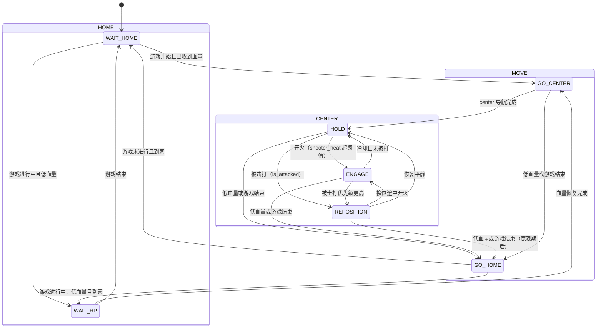

# decision

导航系统的决策层（包名 `decision`，节点 `bt_action_replacement`）。它根据比赛状态、
机器人血量、导航执行结果和**交战态势**，在 `HOME`、`MOVE`、`CENTER` 三个大状态之间
切换，并把当前状态对应的航点任务下发给 `waypoint_follow_executor`。

决策节点不直接规划路径，也不在循环中创建新的进程。它只负责：

1. 接收比赛和机器人状态（裁判系统数据，经 serial_driver 上行）。
2. 执行分层状态机（含 CENTER 的战斗感知子状态）。
3. 将状态转换为航点任务（CSV 文件或动态路径）。
4. 管理 waypoint executor 的启动、切换和执行结果。
5. 向外发布当前决策状态（`/decision/state`）。

## 1. 状态结构

三个大状态、七个叶子状态。`CENTER` 由交战态势驱动：

| 大状态 | 子状态 | 状态字符串 | 目标 | 作用 |
|---|---|---|---|---|
| `HOME` | `WAIT_HOME` | `HOME.WAIT_HOME` | `wait_home.csv` | 游戏未开始时在出生点等待 |
| `HOME` | `WAIT_HP` | `HOME.WAIT_HP` | `wait_hp.csv` | 低血量回家后等待恢复 |
| `MOVE` | `GO_HOME` | `MOVE.GO_HOME` | `home.csv` | 从其他区域返回家中 |
| `MOVE` | `GO_CENTER` | `MOVE.GO_CENTER` | `center.csv` | 从家中前往中心区域 |
| `CENTER` | `HOLD` | `CENTER.HOLD` | `wait_center.csv` 锚点 | 平静时守住中心锚点 |
| `CENTER` | `ENGAGE` | `CENTER.ENGAGE` | 当前位 | 开火中站定输出 |
| `CENTER` | `REPOSITION` | `CENTER.REPOSITION` | `patrol.csv` 随机点 | 被打压时换位摆脱火力 |

初始状态固定为 `HOME.WAIT_HOME`。

## 2. 状态切换总览



## 3. 决策优先级

每拍 `tick()`（`loop_hz`，运行配置 30Hz）按固定优先级判断，高优先级抢占低优先级。

### 3.1 第一优先级：游戏未进行

游戏进行的判定条件：

```text
game_progress == game.progress (默认 4)
game.lower_remain_time <= stage_remain_time <= game.higher_remain_time
```

不满足时：已在 `WAIT_HOME` 保持；`WAIT_HP` → `WAIT_HOME`；`GO_HOME` 继续回家、
到达后 `WAIT_HOME`；其余一律 → `GO_HOME`。

### 3.2 第二优先级：低血量恢复

迟滞双阈值，避免血量在单阈值附近波动引发抖振：

```text
current_hp <  hp_recovery.low_threshold  (120) -> 进入恢复
current_hp >= hp_recovery.high_threshold (400) -> 退出恢复
```

在 `WAIT_HOME` 检测到低血量直接 `WAIT_HP`（人已在家）；其他状态 → `GO_HOME`，
到达后 `WAIT_HP`；恢复后 → `GO_CENTER`。

**例外**：`REPOSITION` 在 `combat.reposition_grace_sec`（3.0s）宽限期内暂缓回家——
换位是为了摆脱火力，中途掉头反而更容易被集火。

### 3.3 第三优先级：正常流程

`WAIT_HOME`（须已收到有效血量）→ `GO_CENTER` → 收到 `Center + Succeeded` →
`CENTER.HOLD`，之后由交战态势驱动。

## 4. 交战态势（CENTER 子状态）

`DecisionContext::combatAssessment()` 从裁判系统数据推断态势，优先级
**被打 > 开火 > 平静**：

| 态势 | 判据 | 对应子状态 |
|---|---|---|
| `Suppressed` | `robot_status.is_attacked` | `REPOSITION`（最小保持 `reposition_hold_sec` 0.5s） |
| `Engaging` | `robot_status.shooter_heat >= combat.firing_heat_threshold`（1） | `ENGAGE`（最小保持 `engage_hold_sec` 0.4s 防抖） |
| `Calm` | 其余 | `HOLD` |

`combat.enable=false` 或数据无效时退化为纯 `HOLD`（等价于旧版守点行为）。

**子状态的战术执行**（节点层，不走固定"状态→CSV"映射）：

- `HOLD`：下发 `wait_center.csv` 锚点，漂移由守点机制纠偏（见 §6）。
- `REPOSITION`：从 `patrol.csv` 点池随机挑 `combat.reposition_path_len`（3）个
  不重复点连成路径下发，走不可预测的换位路线。
- `ENGAGE`：站定当前位；若换位路径仍在执行，用"当前位"目标打断它。

## 5. 导航完成事件

状态机不以"已发送目标"切换状态，而是等待 executor 的结果事件：

| executor 状态 | 决策事件 |
|---|---|
| `COMPLETED` | `Succeeded` |
| `ABORTED` | `Aborted` |
| `RUNNING` | 只更新执行目标，不触发切换 |

事件带目标名称，目标与事件同时匹配才允许切换（`GO_CENTER` 只认
`Center + Succeeded`，`Home + Succeeded` 无效）。事件每拍只消费一次，
防止同一条完成消息重复触发。

## 6. 等待状态的持续守点

`WAIT_HOME`、`WAIT_HP` 和 `CENTER.HOLD` 不是"发一次目标就完"，而是持续守住位置：

1. 进入时执行对应航点。
2. 到达后经 TF（`maintain_goal.robot_base_frame`，`base_link_fake`）取 `map` 下位置。
3. 偏离超 `maintain_goal.xy_tolerance`（0.35m）开始计时。
4. 持续偏离 `maintain_goal.drift_hold_sec`（0.8s）后重发等待目标。
5. 回到容差内清零计时。

TF 不可用时不猜测偏离、不定时重发（TF 查询失败最多每秒一次并节流告警），
避免异常下反复重启导航线程。`GO_HOME`、`GO_CENTER`、`REPOSITION` 是一次性
导航任务，不守点。

## 7. 对外接口

**订阅**

| 话题 | 类型 | 来源 | QoS |
|---|---|---|---|
| `robot_status` | `decision_interfaces/RobotStatus` | serial_driver（裁判系统） | QoS(10) |
| `game_status` | `decision_interfaces/GameStatus` | serial_driver（裁判系统） | QoS(10) |
| `/waypoint_editor/follow_status` | `std_msgs/String` | waypoint_follow_executor | reliable + transient_local |
| `/waypoint_editor/through_status` | `std_msgs/String` | waypoint executor | reliable + transient_local |

`RobotStatus` 字段：`robot_id`、`current_hp`、`shooter_heat`、`team_color`、
`is_attacked`；`GameStatus` 字段：`game_progress`、`stage_remain_time`
（定义在 `src/interfaces/custom_msgs`，包名 `decision_interfaces`）。

**发布 / 服务客户端**

| 接口 | 类型 | 说明 |
|---|---|---|
| `/decision/state` | `std_msgs/String` | 当前状态字符串，reliable + transient_local（晚启动的订阅者立即拿到最近状态） |
| `/waypoint_editor/executor_waypoints` | `nav_msgs/Path` | 动态航点路径（REPOSITION 用），latched |
| `/waypoint_editor/saved_waypoint_file` | `std_msgs/String` | CSV 航点文件路径，latched |
| `start_waypoint_following` / `start_waypoint_through` | `std_srvs/Trigger` | 启动 executor 执行 |
| `/goal_pose` | `geometry_msgs/PoseStamped` | 仅"立即抢占"场景直发（回家类目标） |

**数据流**

```text
robot_status ─┐
              ├─> DecisionContext ──> combatAssessment()
game_status ──┘          │
                         v
                DecisionStateMachine::tick()
                         │
                         ├─> /decision/state（状态字符串）
                         v
              节点层战术处理（HOLD 锚点 / REPOSITION 随机路径 / ENGAGE 站定）
                         │
                         v
               WaypointExecutorClient ──> waypoint_follow_executor
                         │                        │
                         │                        ├─> /goal_pose -> navigation2 (rm_nav2_compat/规划器)
                         │                        └─> follow_status -> 完成事件
```

决策不直接接 navigation2：目标经 waypoint_follow_executor 转成 `/goal_pose`，
由导航栈消费；导航结果经 `follow_status` 回流成决策事件。

## 8. 任务下发防护

- 相同目标正在运行时不重复请求；服务请求未返回时不重复创建。
- 连续相同请求合并；切换任务复用同一个 executor。
- TF 缺失时不通过定时重发重启执行线程。
- 决策循环不调用 `system()`/`popen()`/`fork()`，不启动新 launch。

这些限制防止"状态异常 → 重发目标 → 重启线程 → 再次异常"的高频循环。

## 9. 参数

声明在 `src/decision_config.cpp`，默认值在 `include/decision/decision_config.hpp`
的结构体里；运行配置 `config/bt_action_replacement.yaml`（**根键必须与节点名
`bt_action_replacement` 一致才生效**）。挑关键项：

| 参数 | 代码默认 | 运行配置 | 说明 |
|---|---|---|---|
| `loop_hz` | 10.0 | 30.0 | 决策节拍 |
| `game.progress` | 4 | — | 比赛进行的 progress 值 |
| `hp_recovery.low_threshold` / `high_threshold` | 120 / 400 | — | 血量迟滞双阈值 |
| `combat.enable` | true | — | 战斗感知开关，关掉退化为纯 HOLD |
| `combat.firing_heat_threshold` | 1 | — | 判定开火的枪口热量 |
| `combat.engage_hold_sec` / `reposition_hold_sec` | 0.4 / 0.5 | — | 子状态最小保持（防抖） |
| `combat.reposition_path_len` | 3 | — | 换位路径点数 |
| `combat.reposition_grace_sec` | 3.0 | — | 换位期间暂缓回家的宽限期 |
| `maintain_goal.enable` / `xy_tolerance` / `drift_hold_sec` | true / 0.35 / 0.8 | — | 守点纠偏 |
| `maintain_goal.robot_base_frame` | `base_link_fake` | — | 守点用的机器人 frame |
| `targets.*_waypoint_file` | ""（6 个） | bringup 传入 | 各状态航点 CSV |
| `waypoint.switch_distance` / `final_goal_tolerance` | 0.6 / 0.35 | — | 航点推进/到点判定 |

`validateDecisionConfig` 会对下限做 clamp 并保证血量阈值有序。

## 10. bringup 接入

`bringup/launch/real.launch.py` 用 `use_decision:=True`（默认）直接起
`bt_action_replacement_node`，参数按 `包内 yaml → use_sim_time → 航点文件字典`
叠加，六个 `targets.*_waypoint_file` 指向 `bringup/config/waypoints/RMUL/*.csv`。

两个刻意的写法：

- **不 include `decision.launch.py`**：它会再起一个 `waypoint_follow_executor`，
  与 bringup 已起的重复。包内 launch 仅供独立调试。
- **路径走 `FindPackageShare` 而非 `get_package_share_directory`**：后者在构建
  LaunchDescription 时就解析，decision 未安装时即使 `use_decision:=False`
  也会抛异常，把整条导航链带崩。

依赖 serial_driver（`use_serial_driver:=True`）提供 `robot_status`/`game_status`；
没有裁判数据时状态机停在 `WAIT_HOME`（收不到血量不会出发）。

## 11. 主要文件

| 文件 | 作用 |
|---|---|
| `src/decision_node.cpp` | 节点 `BtActionReplacementNode`：订阅发布、定时循环、TF、战术处理 |
| `src/decision_state_machine.cpp` | 状态切换规则、优先级、`tickCenter()` 交战子状态 |
| `src/decision_state.cpp` | 状态字符串化、状态→目标映射、`/decision/state` QoS |
| `src/decision_context.cpp` | 保存 RobotStatus/GameStatus、计算交战态势 |
| `src/waypoint_executor_client.cpp` | executor 请求、路径下发、执行状态跟踪 |
| `src/waypoint_store.cpp` | 加载 CSV、准备 follow 航点（选机器人前方的点） |
| `src/decision_config.cpp` | 参数声明、读取、校验 |
| `include/decision/types.hpp` | `TargetName`、`EngagementState`、`CombatAssessment` 等基础类型 |
| `config/bt_action_replacement.yaml` | 运行参数 |
| `doc/combat_aware_decision_plan.md` | 战斗感知决策的设计文档 |
| `scripts/test_topics_publisher_gui.py` | 手动发布裁判数据、回显决策状态的测试 GUI |
| `test/` | 状态机/配置/航点/executor 客户端的 gtest 与 launch 集成测试 |

## 12. 修改状态机时的注意事项

1. 新增状态时同步更新状态类型、字符串转换和目标映射三处。
2. 抢占条件（游戏结束、低血量）必须排在正常流程之前；交战子状态只在 CENTER 内部推进。
3. 导航切换必须校验事件对应的目标，不能只判断 `COMPLETED`。
4. 等待状态守点、移动状态一次性执行，两类不要混。
5. 不要在 `tick()` 或定时器回调中创建进程、节点或长期线程。
6. 对重复服务请求、异常状态消息和 TF 缺失保持节流/去重。
